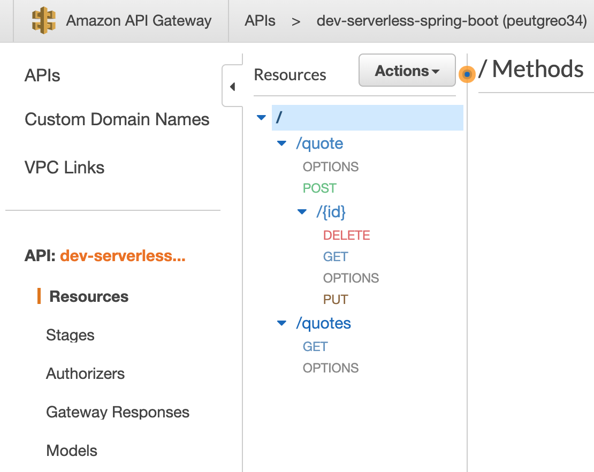

# Serverless Spring Boot Application
**Maintained by:** [Klesio Silva](klesiossss@gmail.com)

# Introduction
Developed to introduce serverless framework over spring boot.

## Architecture

## Basic Commands
# user
query User {
user(id: "79da92de-c7e4-4481-8964-dc520f76842f") {
id
name
email
}
}

# users

query Users {
users {
id
name
email
}
}

# create
mutation CreateUser {
createUser(input: {name: "pedro", email: "pedro@gmail.com"}) {
name
email
}
}

# update
mutation UpdateUser {
updateUser(input: {name: "antony swants", email: "antony@gmail.com"}, id: "79da92de-c7e4-4481-8964-dc520f76842f") {
id
name
email
}
}

# delete
mutation DeleteUser {
deleteUser(id: "1") {
id
name
email
}
}

## Tech Stack
 - Serverless Framework 
 - Spring Boot
 - Lambda
 - DynamoDB

## Pipeline
  - build
  - unitTes
  - integrationTest
  - featureTest
  - dev
  - staging
  - prod

Note: CI Stages are running by default but CD Stages configured as manual.

## Demo API

More API info could be found on swagger-ui by running locally and navigate http://localhost:8080/swagger-ui.html

## Local Development
### Preconditions
 - aws cli
 - npm
 - Serverless Framework

### Build
 - gradle build
 
### Deploy 
 - sls deploy --stage dev

### Destroy
 - sls remove --stage dev
